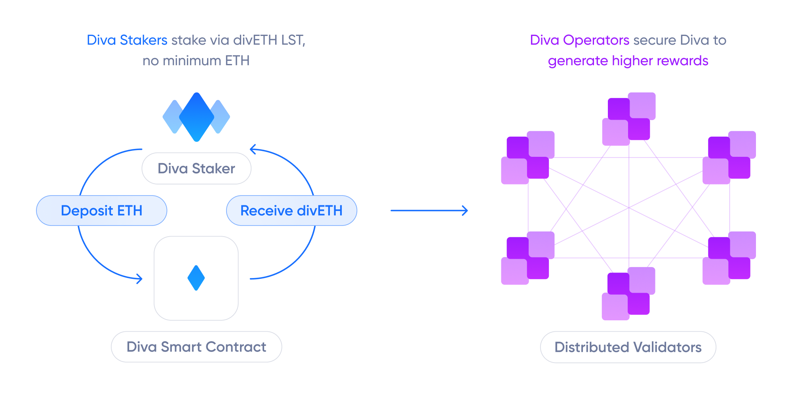

# Diva's Liquid Staking

Diva is an Ethereum Liquid Staking protocol powered by Distributed Validator Technology (DVT).

It is a fully integrated tool that improves the lives of Stakers and Operators:

- Stakers receive a Liquid Staking Token (divETH), which automatically may accrue value from Ethereum's staking rewards without needing to run any infrastructure.
- Operators run a Distributed Validation (Diva) client to fulfill staking duties and earn Ethereum's rewards.

Ethereum’s staking rewards are distributed among the diva protocol participants to balance the interests of the network.

While other solutions have features like Liquid Staking or DVT as tools, Diva is the first protocol that fully integrates them, offering Stakers and Operators the best security and economic model.

## Diva Rewrites the Rules

### Validator Design

- 🌳 Resilient: nodes are fully disposable 
- ❤️‍🔥 Self-healing: Ability to recover full network liveliness by resharing keys
- 💠 Redundancy: Up to 500x better uptime thanks to DVT fallbacks

**Incentives and Penalties**
- 📈 Socialized smooth rewards
- ⛔️ Quick ejection of bad actors

**Trust-minimized Architecture**
- 🔐 "Can't be evil" cryptoeconomic system
- 🛡️ [Economic guarantees](participants#operators)