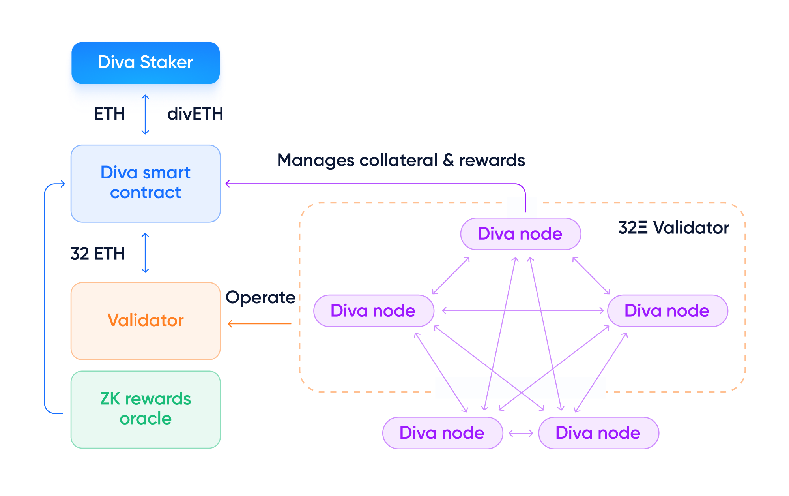

# Stakers & Operators

:::tip
The Diva Staking Smart Contract acts as a bridging mechanism. It deposits ETH into Ethereum Beacon Chain validators while returning a divETH receipt that can be used to later withdraw those ETH plus any staking rewards it might have accrued.

:::

## Liquid Stakers (or "Stakers")

**Liquid Stakers deposit ETH to obtain divETH** which automatically accrues Ethereum staking rewards (if any).

Anyone can become a Liquid Staker with no minimum ETH requirement. Stakers depositing ETH to the Diva Smart Contract will instantly receive a transferable receipt token called divETH representing their staked ETH + any staking rewards it generates.

Diva's staking is "liquid" because Stakers receive liquid divETH, meaning it is immediately transferable or tradable, as opposed to being locked.

Wallets holding divETH will see their balances update daily to reflect accrued staking rewards (or penalties, if any). This is accomplished via a [rebasing mechanism](lst).

The divETH token can:

- Be redeemed for ETH at any time by requesting a withdrawal from the Diva Staking Smart Contract.
- Be used in the DeFi ecosystem for lending, bridging, etc.

It is a standard ERC20 which enables composability with most DeFi apps. If needed, [divETH can be wrapped into wdivETH](lst), the static balance receipt token.

## Operators

**Operators running Diva nodes can lock some divETH as collateral** to secure Ethereum and generate divETH rewards.

An Operator performing their validation duties correctly will receive divETH as staking rewards.

To incentivize good behavior, an Operator misbehaving or missing their validation duties might suffer penalties on their locked divETH.

Operators can only receive Key Shares once they provide enough divETH collateral to the Diva Smart Contracts. Should an Operator causes any losses, this collateral can be transferred to Stakers to compensate them:

- Stakers receive <u>staking rewards protected by Operator collateral</u>.
- Operators receive the <u>base network divETH rewards</u> + <u>potential divETH rewards for each key-share they operate</u>.

The more divETH an Operator locks, the more Key Shares they may receive, increasing their ability to generate rewards.

### Non-custodial validation

Unlike other solutions, Operators are completely non-custodial. They never have access to the funds or private key of the validators.

The Diva Smart Contract acts as a bridge, depositing ETH into the Ethereum Beacon Chain (or "Consensus Layer") where they are used to set up validators.

Each 32Ξ Ethereum validator is operated by 16 Diva Key Shares, which are distributed to different Operators who have posted enough collateral.

When a validator needs to sign its validation duties, at least 2/3rds of its Key Shares need to come to consensus on what to sign in order to perform any action.

This 66% consensus is the key to [Diva's own DVT](dvt), making the system more reliable and safe. Diva Staking creates keys using Distributed Key Generation (DKG) to sign duties using “Boneh–Lynn–Shacham” BLS threshold signatures.

### Diva vs Ethereum staking

Diva acts as an extension of Ethereum staking, providing additional functionalities without compromising on decentralization:

- On Ethereum, stakers lock 32Ξ to create a validator, and must run a node to operate it.
- With Diva,
  - Liquid Stakers can deposit **any amount of ETH** and **receive liquid divETH**. No node running required!

Running a Diva node is [generally preferable to running solo validator](solo-staking) on Ethereum with 32Ξ, and requires only 1Ξ.

Network rewards are aggregated from the entire network (EL + CL + MEV), making them smoother and more predictable.

**With Diva, operators can run nodes without advanced skills, greater flexibility, and from only 1Ξ.**

