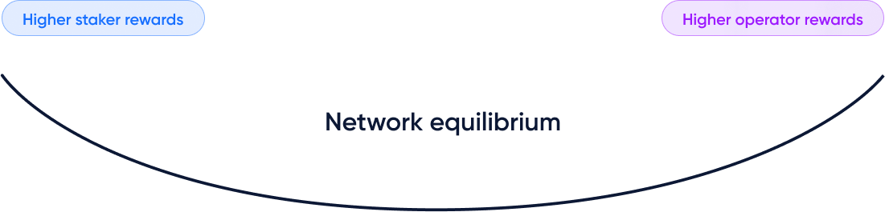

# Features

Diva is aiming to become **the most decentralized & resilient staking protocol**, offering the best conditions to both Stakers and Operators.

## Liquid Staking

Stakers obtain a liquid token, divETH, representing their ETH and the accrued value of their ETH rewards. There are no lock-ups or minimum deposits.

divETH is a rebasing token, with its balance updating daily in your wallet as it accrues staking rewards.

1 divETH is always backed by 1 ETH. divETH can be used like regular ETH. The difference is that no action is required to generate staking rewards. 

It is also possible to convert divETH to a non-rebasing token, wdivETH (wrapped divETH). wdivETH is an alternative token where the balance is not updated daily. Instead, a static amount of wdivETH typically appreciates versus ETH over time, and its value accrual consolidates once “unwrapped” back into divETH.

[Learn more about the divETH and wdivETH liquid staking tokens](/lsd)

### Two LST flavors

Diva's Liquid Staking token is available in a rebasing (divETH) and non-rebasing version (wdivETH), to fit all use cases.

It's designed to be compatible with Lido's stETH, working in very similar ways, to facilitate integrations with apps that already support stETH.

### Non-custodial

Operators never have access to user funds. Diva automatically stakes all ETH provided into Ethereum's Proof of Stake deposit contract.

Further, Operators never have access to private validator keys and are unable to unilaterally withdraw funds from validators.

### Staker Protection

Staking is risky, because if Operators are offline or malicious, Stakers can face partial or full loss of ETH funds.

In Diva, Stakers are protected against losses because Operators provide ETH collateral which is transferred to Stakers to compensate potential losses.

### Smooth rewards

Diva's LSTs accrue rewards daily, averaging all the rewards in the network. This provides smoother and more predictable returns with low volatility.

## Distributed Validators

Diva stands for "**Di**stributed **Va**lidation".

Diva uses Distributed Key Generation (DKG) to split private validator keys into key-shares operated by separate nodes using Boneh–Lynn–Shacham (BLS) Threshold Signatures. 

All validator actions require a consensus signature of approximately 2/3rds of nodes in the committee, making Diva resistant to collusion attacks.

Key-shares are generated using Multi-Party Computation (MPC) so secret keys never come together. This greatly reduces the risk of hacks or loss of private keys.

### Permissionless 

Diva allows anybody to stake ETH or operate a node without requiring any kind of permission.

### Decentralized

Every Diva validator is a Distributed Validator, operated by a stochastically distributed sub-network of nodes.

The protocol has Sybil protection mechanisms and is focused on reducing the barriers to entry for Operators, promoting diversity and true decentralization.

### Resilient

Thanks to the properties of Diva's validator sets, only 66% ("n of m") signatures are needed to reconstruct the total signature representing the private key for each validator.

Consequently, Diva validators tolerate up to "m - n" failing nodes, and the validation will not be affected in case of partial validation failure. This makes Diva resilient to periods of node unavailability, even when multiple nodes go offline, and allows safety mechanisms to safely regenerate DKG and recover network liveliness.

### Self-healing operation

Diva's uses secure resharing mechanisms to eject failing Operators, allowing it to recover full liveliness of the network even in the event of unexpected failures, hacks or censorship.

###  Efficient networking

Diva uses a P2P network for node discovery. Communications occur directly between peers without the need for a "Diva Blockchain". This reduces delays that could affect the validation performance, and minimizes single points of failure.

Diva's unique consensus algorithm allows Diva validators to achieve similar performance to the best-operated Ethereum validators.

### Self-balancing economics

Diva has native mechanisms to balance the rewards of Stakers and Operators to ensure that there is always a full alignment of incentives and security.

## Trust-minimized

Diva is designed to minimize the trust required from any party, providing:

- A strong economic model that aligns the interests of all parties.
- ETH bonds as a guarantee to make up for any potential losses.
- Zero-knowledge mathematical proofs for reports and calculations.

### Immutable, non-upgradable contracts

Most of Diva’s smart contracts are immutable and non-upgradable, minimizing the potential vectors of attack.

Diva is working towards a minimized-governance design and ossifying its operations.

### Censorship-resistant

Diva’s architecture has been designed to be censorship-resistant, in line with Ethereum's community values.

### No trusted committees

Most staking protocols have committees, multisigs or guardians with the power to access funds, override protocol operations or affect economic decisions. That introduces vulnerabilities, for example, a rewards oracle committee could collude to report false rewards and manipulate prices.

Diva's design replaces trusted groups with components like Zero-Knowledge Proof (ZKP) oracles which are resistant to manipulation.

