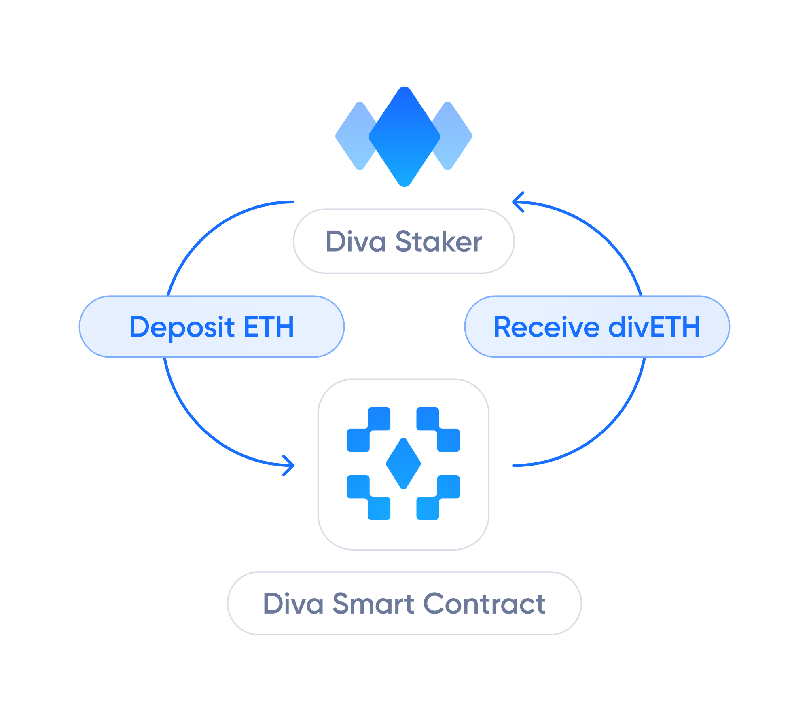
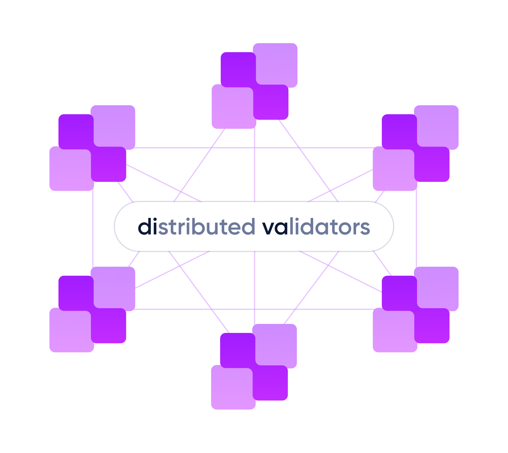
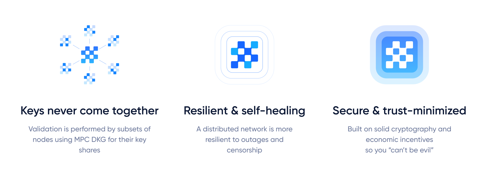

# Features

:::info
Diva is aiming to become **the most decentralized & resilient staking solution**, offering the best features to both Stakers and Operators.
:::

## 💧 Liquid Staking

Diva Staking allows Liquid Stakers to generate staking rewards without having to lock their ETH.

Liquid Stakers simply need to hold their divETH to generate [Staking Rewards](staking-rewards), and can also use it in DeFi for things like lending, bridging, etc.

This provides a model with many advantages [Ethereum's native staking](solo-staking), which requires locking 32Ξ without liquidity and operating hardware.

[Learn more about Diva's Liquid Staking](lst).

### 🔒 Non-custodial

Operators never have access to user funds. Diva Staking automatically stakes all ETH deposited, by depositing it into [Ethereum validators](glossary#validator).

Further, Operators never have access to full validator keys and are unable to unilaterally request the withdrawal of funds from validators.

### 🤝 Staker Protection

Staking is risky, because if Operators are offline or malicious, Stakers can face partial or full loss of ETH funds.

In Diva, Stakers are protected against losses because Operators provide [collateral](glossary#collateral) which is pledged to Stakers to compensate potential losses.

### 📈 Smooth rewards

Diva's LSTs recalculate rewards daily, aggregating all the [Staking Rewards](staking-rewards) generated by the network. This provides smoother and more predictable returns with lower volatility than classic staking.

## 💠 Distributed Validators

"DiVa" stands for "**Di**stributed **Va**lidation".

Diva Staking uses [its own DVT](dvt) to deliver superior performance and risk management. 

All validator actions require a consensus signature of 2/3rds of nodes in the committee, making Diva resistant to collusion attacks.

Key-shares are generated using Multi-Party Computation (MPC) so secret keys never come together. This greatly reduces the risk of hacks or loss of private keys.

### 👨‍👩‍👧‍👦 Permissionless 

Diva allows anybody to stake ETH or operate a node without requiring any kind of approvals or permissions.

### 🌎 Decentralized

Every Diva validator is a Distributed Validator, operated by a stochastically distributed sub-network of nodes.

Diva has built-in Sybil protection mechanisms and is focused on reducing the barriers to entry for Operators, promoting diversity and true decentralization.

### 🌳 Resilient

Thanks to the properties of Diva's validator sets, only 2/3rds ("n of m") signatures are needed to reconstruct the total signature representing the private key for each validator.

Consequently, Diva validators tolerate up to "m - n" failing nodes, and the validation will not be affected in case of partial validation failure.

This makes Diva resilient to periods of node unavailability, even when multiple nodes go offline, and allows safety mechanisms to safely regenerate DKG and recover network liveliness.

### ❤️‍🔥 Self-healing network

Diva's uses secure resharing mechanisms to eject failing Operators, allowing it to recover full liveliness of the network even in the event of unexpected failures, hacks or censorship.

### 🚅 Efficient networking

Diva uses a P2P network for node discovery. Communications occur directly between peers without the need for a "Diva blockchain". This reduces delays that could affect the validation performance, and minimizes single points of failure.

Diva's unique consensus algorithm allows Diva validators to achieve similar performance to the best-operated Ethereum validators.

### 🔢 Diva Staking Cryptoeconomic mechanisms

Diva Staking uses cryptography to ensure correctness of operations wherever possible (for example, for signatures), and economic incentives where cryptography alone is not enough (for example, incentivizing Operators to stay online). This ensures a full alignment of incentives and security.

## 👀 Trust-minimized

Diva is being designed to minimize the trust required from any party, providing:

- A strong cryptographic model to protects staking operations.
- ETH collateral as protection towards potential losses.
- Zero-knowledge mathematical proofs for reports and calculations.

### 🪨 Immutable, non-upgradable contracts

Diva’s smart contracts are aiming to be immutable and non-upgradable, minimizing the potential vectors of attack. This way Diva does not rely on human intervention.

Diva Staking is designed to require minimum updates if any at all.

This allows all users to use divETH as a rock-solid primitive for the future of Defi.

### 💬 Censorship-resistant

The architecture of the Diva Staking Protocol has been designed to be censorship-resistant, in line with Ethereum's community values.

### 🛂 No trusted committees

Most staking protocols have committees, multisigs or guardians with the power to access funds, override protocol operations or affect economic decisions. That introduces vulnerabilities, for example, a rewards oracle committee could collude to report false rewards and manipulate prices.

The design of the Diva Staking Protocol replaces trusted groups with components like Zero-Knowledge Proof (ZKP) oracles which are resistant to manipulation.

## 💠 An extension of Ethereum

**Ultimately, the Diva Staking Protocol acts as a software extension of Ethereum**, providing permissionless mechanisms to perform staking in a more efficient and decentralized way.
