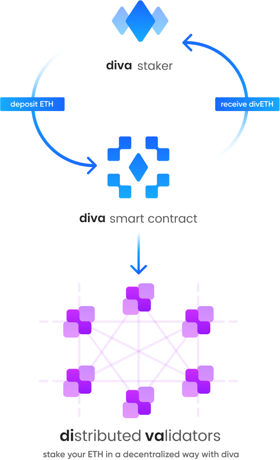

# Introduction

Diva is an Ethereum Liquid Staking protocol powered by Distributed Validator Technology (DVT).

It is a vertically integrated protocol that connects Stakers and Operators:

- Stakers obtain a Liquid Staking Derivative (divETH) that accrues value with Ethereum’s staking rewards automatically without the need of running any infrastructure.
- Operators can run a Distributed Validation (Diva) client to fulfill staking duties and earn additional rewards.

Ethereum’s staking rewards are distributed to the Diva protocol participants to balance the interests of the network.

While other solutions have features like liquid staking or DVT as tools, Diva is the first end-to-end solution that fully addresses the current economical and technical challenges that Ethereum's staking mechanism poses.

