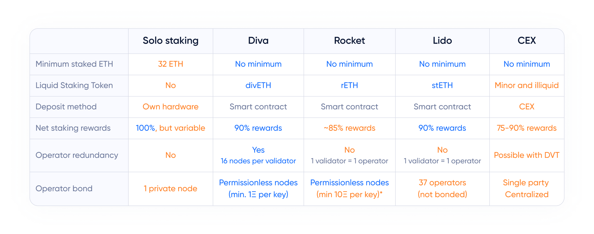

# Diva comparison

Diva is designed to be compatible with existing Liquid Staking protocols:

- Anyone can stake with Diva with no minumum ETH requirement
- divETH allows for easy integration in Defi

Diva rewards are expected to be better than for other protocols, by using a dynamic balance between Stakers and Operators

The unique advantage of Diva's DVT is that it offers:

- Node redundancy and significantly better uptime (*~500x better!*)
- Protection against single nodes failing or acting maliciously
- A permissionless Operator set that anyone can join, favoring diversity

