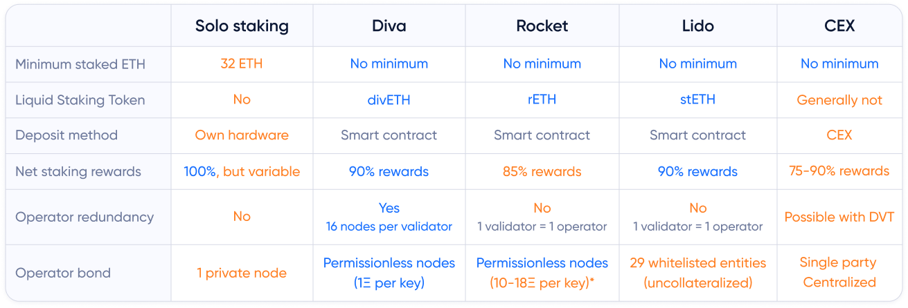
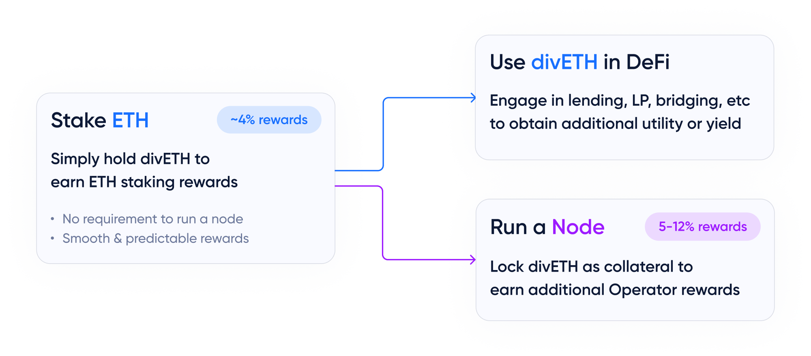

# Diva comparison

## Three ways to engage with Diva

Unlike other solutions, Diva gives users three ways to engage, so anybody can either use or power the network staking capabilities.

- [Anyone can stake with Diva](participants) with no minimum ETH requirement.
- [divETH and wdivETH](lst) allow for easy integration in Defi.
- [Anyone can run a Diva node](operators) to earn [higher rewards on their ETH](economics).

Diva staking rewards are expected to be similar to major protocols, as the source of its [Staking Rewards](staking-rewards) is the Ethereum's Consensus Layer itself.

However, Diva Operators combine Staking Rewards on their divETH plus [additional Operator Rewards](economics) for powering the network.

## Diva's unique advantage

Diva uses [its own DVT](dvt) to provide better uptime and risk management with no centralized parties:

- Node redundancy delivers significantly better uptime (*[~500x better!](dvt)*)
- Protection against single nodes failing or acting maliciously.
- A permissionless Operator network that anyone can join, favoring diversity.

