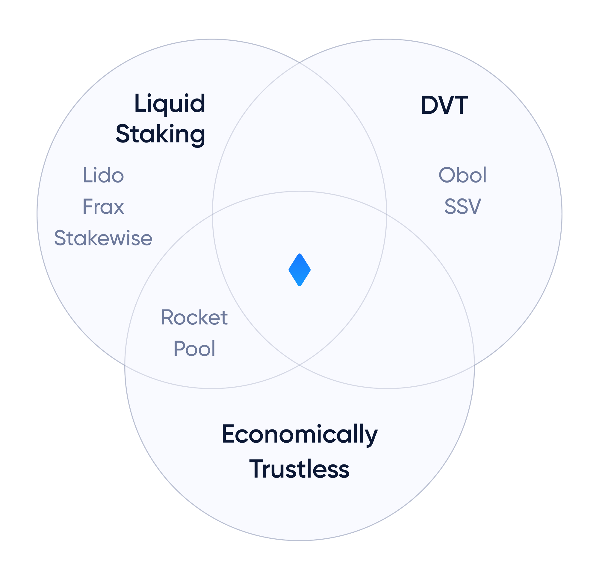

# Diva vs Obol vs SSV

Obol, SSV and Diva are the main projects developing Distributed Validator Technology (DVT).

The main difference is that Obol and SSV focus on DVT, while Diva is a fully integrated Liquid Staking solution powered by DVT.

## Diva's DVT

Diva's DVT is deeply integrated with its Liquid Staking economic system. It has built-in mechanisms to reward good actors while ejecting bad actors. Its rational non-deterministic consensus is twice as fast as classic DVT.

Diva’s liquid staking, non-custodial nature, advanced distributed validation, and trust-minimized design make it the more appealing option for users seeking a decentralized and resilient staking protocol.

## Key Differences vs Obol

1. [Liquid Staking](lst): Diva offers liquid staking with divETH and wdivETH tokens, while Obol does not.
2. Advanced [Distributed Validation](dvt): Diva uses DKG and BLS Threshold Signatures, while Obol relies on Charon middleware client.
3. Resilience: Diva is more resilient to node failures and maintains network liveliness.

## Key Differences vs SSV

1. [Liquid Staking](lst): Diva provides liquid staking through divETH, a token representing staked ETH and its staking rewards, while SSV does not provide liquid staking.
2. Non-custodial operations: Both protocols ensure that operators never have access to user funds or private validator keys.
3. Resilience: Diva's validators can tolerate up to "m - n" failing nodes, making it more resilient to node unavailability and failures compared to SSV.
4. Efficiency: Diva uses a P2P network for node discovery, reducing delays and single points of failure, while SSV relies on the IBFT algorithm for consensus.
5. Immutable Contracts: Diva's smart contracts are mostly immutable and non-upgradable, minimizing potential attack vectors.
6. Censorship-resistance and Permissionless: Diva is designed to be censorship-resistant and allows anyone to stake ETH or operate a node without permission.
7. Self-healing Network: Diva has secure resharing mechanisms to eject failing operators and recover network liveliness, while SSV does not have this feature.
8. No Trusted Committees: Diva replaces trusted committees with Zero-Knowledge alternatives, making it more resistant to manipulation.

While both SSV and Diva offer unique validating solutions, Diva emerges as a superior choice for those seeking a decentralized and resilient staking protocol integrated with Distributed Validators.

## Diva = Liquid Staking + DVT + Economic model

