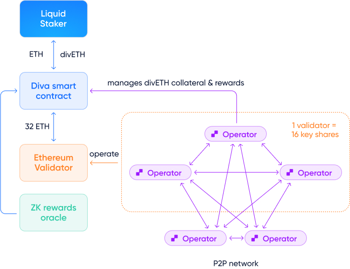

# Diva Operator economics

What makes Diva unique is that all ETH deposits are staked and operated by permissionless & trustless Operators.

**In a nutshell**: Stakers deposit ETH to obtain divETH. Operators lock divETH and run a node to generate additional divETH Operator Rewards. Validation is fully handled by the Diva client with no action from the user.

This happens in several steps, as illustrated below:

1. Liquid Stakers deposit ETH to Diva's Smart Contract and receive [liquid divETH](lst), which generates [Staking Rewards](staking-rewards).
2. ETH deposits are deposited (or *bridged*) to the Ethereum Consensus Layer in increments of 32 ETH to create [Ethereum validators](glossary#validator).
3. Each validator is operated by 16 [Key Shares](glossary#key-share), which together act as a [validator key](dvt).
4. Operators can **lock [divETH collateral](glossary#collateral)** to **run a Diva node** and **operate Key Shares** to generate additional Operator Rewards.

Diva's distribution of Key Shares means there are 16x more Operators participating in Ethereum's attestations and block production, contributing to the network's decentralization. Anyone can participate from only 1 ETH!

## Diva's trust-minimized security model

Staking provided by [centralized exchanges](exchanges) or protocols like [Lido](lido) require you to trust the entities staking your ETH. If they fail or are shut down, your ETH can ultimately be affected in unpredictable ways. This is often called "Proof of Authority" and creates risks.

**Diva is designed to be unstoppable**, just like Ethereum's Proof of Stake. It runs using on-chain software, so you can trust cryptography and not humans.

Unlike other solutions, *anyone* can run a Diva Operator permissionlessly. Liquid Stakers are protected by:

- Cryptography: [Diva's DVT](dvt) distributes duties across the network to ensure there aren't single points of failure.
- Collateral: Operators post [divETH collateral](glossary#collateral) to guarantee they fulfill their duties responsibly.

## Staker economics

All divETH holders receive [Staking Rewards](staking-rewards), which aggregate & smooth all staking rewards regardless of their source, including block proposals, attestation rewards, MEV, etc.

10% of the Total Rewards are paid to to Operators as compensation for their services as Operator Rewards.

There is no "DAO fee" in Diva.

## Operator economics

Diva Operators post [divETH collateral](glossary#collateral) as a guarantee. The more divETH they post, the more [Key Shares](glossary#key-share) they can receive.

At this moment, receiving **1 Key Share requires locking 1 divETH**. Operators posting divETH collateral will enter a queue to receive Key Shares whenever the network creates new validators. 

Operators receive two potential income streams:

- [Staking Rewards](staking-rewards): divETH collateral generates rewards as it would for a Liquid Staker *even while waiting for key shares*.
- Operator Rewards: when correctly operating key shares, Operators generate additional divETH.

This bears some similarities with "re-staking", as it provides divETH holders a way to further engage with Diva to generate additional rewards that can be significantly higher than Ethereum staking alone.

Diva is [still under development](roadmap)! More details on the economic model will be posted as they're developed.