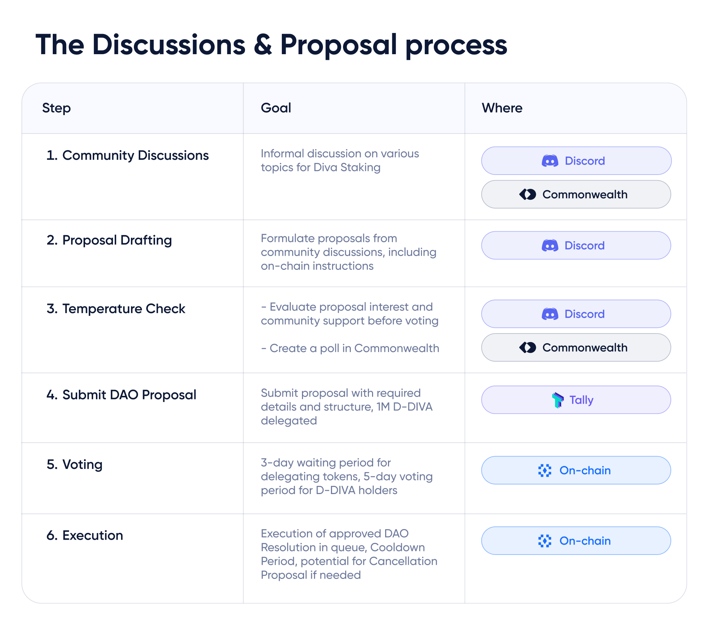

# Discussions & Proposals

Diva Staking's DAO governance offers space for both on-chain and off-chain discussions.

**Here's how you can contribute now to shaping the Diva Staking Protocol:**

- 🗣️ Starting or participating in forum discussions on [Discord](https://discord.com/channels/1041618287500460083/1129055607148773386) or [Commonwealth](https://commonwealth.im/divastaking/discussions).
- ⛓️ [Submitting or voting on DAO proposals](https://www.tally.xyz/gov/diva) for on-chain decisions.
- 🖥️ Being an active participant as a [Liquid Staker](https://stake.diva.community) or [Operator during testnet](https://docs.staking.foundation/operators).

All participants in the DAO are strongly encouraged to follow the [Diva DAO community guidelines](https://github.com/staking-foundation/diva-dao/blob/main/Community-Guidelines.md), which are maintained by the community.

## Step 1: Community Discussions

Before any decision is put up for voting, you can simply start an informal discussion about any thoughts/idea/questions you may have.

Proposals can include topics regarding Diva Staking, suggestions on how to organize the community, research & development, or decentralization initiatives.

Community members are encouraged to participate, following the [DAO community guidelines](https://github.com/staking-foundation/diva-dao/blob/main/Community-Guidelines.md). Forums are open to anyone, as it is important to socialize ideas and gather community feedback before moving on to action.

💬 Participate on discussions or suggest new ideas on [Discord](https://discord.com/channels/1041618287500460083/1129055607148773386) or [Commonwealth](https://commonwealth.im/divastaking/discussions)!

## Step 2: Proposal Drafting

Some discussions will result in a DAO proposal which can be put up for voting.

DAO proposals can simply result in community decisions, like agreements on guidelines, procedures, forming committees, etc. Many proposals do not need to execute code on-chain.

However, **DAO proposals can contain on-chain instructions to be executed by the DAO**, for example:

- Transferring tokens, making payments.
- Deploying smart contracts.
- Changing protocol parameters.

That's what the Diva DAO is for! On-chain code is executed by Ethereum in a resilient and decentralized way.

There are three types of Proposals depending on their impact:

1. **Low Impact**
    - Intended to distribute governance power among communities.
    - Requires +50% favorable votes to be enacted.
2. **Medium Impact**
    - Aiming to adapt or modify a configurable feature.
    - Requires +66% favorable votes to be enacted.
3. **High Impact**
    - Complex proposals aiming to update the Diva Protocol core infrastructure.
    - Requires +75% favorable votes to be enacted.

## Step 3: Request For Comments (RFC) / Temperature Check

In order for a proposal to be formally considered by the community, an off-chain process referred to as ‘temperature check’ must be followed. The goal is to evaluate proposal interest and community support before voting.

The temperature check is done through dedicated threads the [Discord](https://discord.com/channels/1041618287500460083/1129055607148773386) or [Commonwealth](https://commonwealth.im/divastaking/discussions) community forums.

👉 [**Use this DIP template to format your proposal**](https://github.com/staking-foundation/diva-dao/blob/main/DIP-xx%20Template.md) following the [Diva Staking DAO Community Guidelines](https://github.com/staking-foundation/diva-dao/blob/main/Community-Guidelines.md).

## Step 4: Submit DAO Proposal

Proposals are formally posted via an on-chain transaction on [Tally](https://tally.xyz/gov/diva).

They can only be submitted by DAO members with at least 1M D-DIVA delegated.

**Remember, you can only become a DAO member by delegating your DIVA tokens!** Delegated token holders are tasked with the goal of shaping the protocol and increasing its utility, resiliency, and decentralization - Ultimately, the DAO is tasked with making the Diva Staking Protocol better.

The proposal shall include all the fields required by the  [Diva Staking DAO Community Guidelines](https://github.com/staking-foundation/diva-dao/blob/main/Community-Guidelines.md), which are included in the [**suggested DIP template**](https://github.com/staking-foundation/diva-dao/blob/main/DIP-xx%20Template.md) 

## Step 5: Voting

After on-chain creation, there is a **2-day waiting period** for any DIVA token holder to delegate their tokens. Only DAO tokens (delegated DIVA tokens or D-DIVAs) are accounted for governance purposes, including the quorum calculations.

Proposals have a predetermined **5-day voting period** upon submission, allowing D-DIVA holders to vote in favor or object. If the proposal meets a valid quorum (10M D-DIVA) and voting threshold, it becomes a DAO Resolution!

## Step 6: Execution

After meeting the threshold and quorums, an on-chain transaction sets the approved DAO Resolution in a queue for execution, starting a **Cooldown Period**. 
Once the Cooldown period ends, anyone can execute the transaction to implement a DAO Resolution.

The Cooldown periods are:
- 9 days for DCP and DIP proposals
- 14 days for DUP, as they have a higher impact for the protocol.

### Cancelling proposals

DAO Resolutions can be challenged to prevent security issues like governance attacks or fraudulent code implementation. 
For this, a **Cancellation Proposal** must be submitted by a community participant with at least 1M D-tokens delegated, and has a much shorter Cooldown period of 2 hours.

The Cooldown period is:
- 2 hours for Cancellation Proposals.

That means that a Cancellation Proposal can be executed in as little as 7 days and 2 hours (2 days waiting period + 5 day voting period + 2 hour cancellation cooldown period).

More details about voting can be found in the [DAO community guidelines](https://github.com/staking-foundation/diva-dao/blob/main/Community-Guidelines.md). Some DAO parameters can be modified via DAO proposals.
