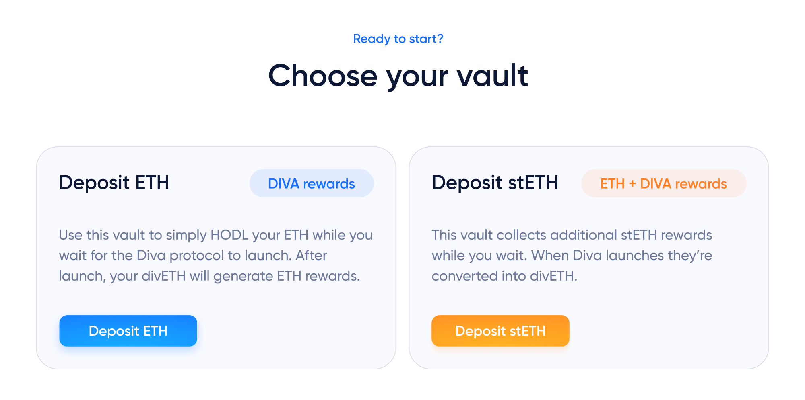

# Early Stakers Initiative

Diva Staking is still under development, but you can already support its launch.

**You can now deposit ETH or stETH into [Pre-Launch Vaults](https://diva.enzyme.finance/#vaults) to become eligible for DIVA tokens**.

:::info Good to know
This is currently the only way to earn DIVA tokens, as they're otherwise not transferable

:::

<iframe width="560" height="315" src="https://www.youtube.com/embed/4QWk4oNdx0I" title="Diva Early Stakers Vaults" frameborder="0" allow="accelerometer; autoplay; clipboard-write; encrypted-media; gyroscope; picture-in-picture; web-share" allowfullscreen></iframe>

👉 **Visit the Diva Early Stakers website to get started** [https://diva.enzyme.finance](https://diva.enzyme.finance)

## How does it work

You can deposit ETH or stETH to signal your support for the Diva Staking launch. Every (st)ETH will earn DIVA tokens for every day in the vault starting 30 days before mainnet launch date.

TVL commitments are important, because they attract Liquid Stakers, [Operators](participants#operators) and facilitate integrations.

### Two vaults

ETH deposits are simply kept in "hold" mode until Diva Staking launches. stETH are also kept untouched until launch, but earn ETH staking rewards as you wait.

Once Diva Staking goes live, all (st)ETH will be converted to [divETH](lst), Diva's Liquid Staking Token (LST), which generates Ethereum staking rewards and can be freely traded on decentralized exchanges (DEXs).

Vaults are non-custodial, allowing depositors to withdraw their funds anytime.

### Rewards

The more (st)ETH you deposit, the more DIVA tokens you will get. You can find the daily reward amount valid for your deposit tranche in the [table](https://diva.enzyme.finance/#table). Alternatively, use the [calculator](https://diva.enzyme.finance/#calculator) to determine the amount of tokens.

If you deposit stETH, you will get both Ethereum staking rewards and DIVA tokens when they start accruing. For example, depositing 10 stETH (into the first tranche) and staying in the vault for the maximum duration will result in 4,575 DIVA rewards plus the full staking rewards (stETH before Diva launch and then divETH).

## Help Diva Staking launch successfully

This is an independently run initiative approved by the [Diva Staking DAO](dao) in [DIP-02](https://www.tally.xyz/gov/diva/proposal/45468458207916765916984557235161596151150976178275597160417224501662414206717).

It aims to accelerate the launch and adoption of Diva Staking by helping to:

-   Gain confidence that the protocol and DIVA are widely adopted
-   Distribute voting power to participants according to their commitments
-   Plan node operator capacity and DeFi integrations ahead of launch

This ultimately helps balance and decentralize the Ethereum staking ecosystem by promoting diversity to its LST landscape and embracing the future of [DVT](dvt) technology.

## DIVA transferability

Please note that DIVA is currently non-transferable and not trading, which means that a token price cannot be established.

[DIP-03](https://www.tally.xyz/gov/eip155:1:0xFb6B7C11a55C57767643F1FF65c34C8693a11A70/proposal/52481024395238134144299582623582875841236980209822828761178984408970724801644) commits to enabling DIVA transferability at latest by the end of the Early Stakers initiative, paving the way to trading and transferability.

### Enzyme protocol and its vault infrastructure

The program is made possible with Enzyme’s on-chain asset management infrastructure and non-custodial smart contract architecture. Stakers retain full self-custody of their funds at all times.

For the full Terms & Conditions, see [proposal](https://www.tally.xyz/gov/diva/proposal/45468458207916765916984557235161596151150976178275597160417224501662414206717) on Tally.

👉 **Visit the Diva Early Stakers website to get started** [https://diva.enzyme.finance](https://diva.enzyme.finance)
