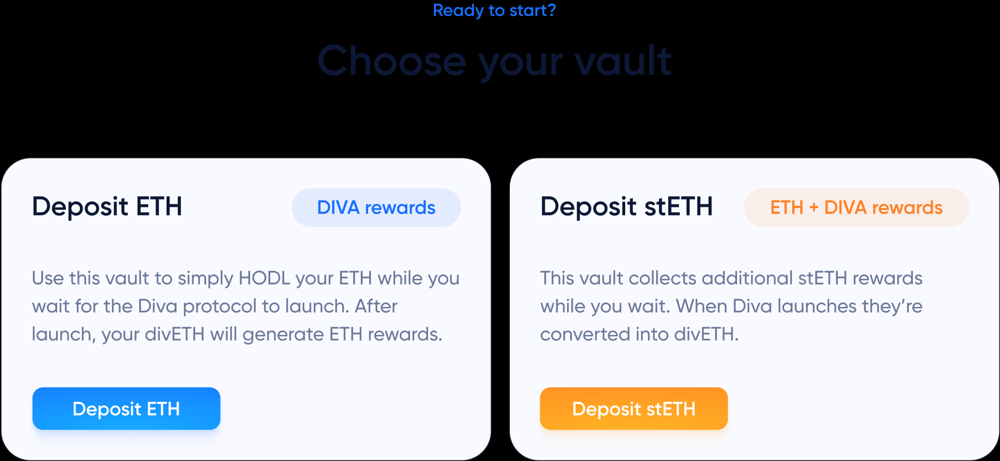

# Early Stakers Initiative

**Early Stakers can now deposit ETH or stETH into [vaults](https://diva.enzyme.finance/) to get DIVA tokens**, depending on whether you want your funds to be staked while you wait. If you deposit stETH, you will get both staking rewards + DIVA tokens. For example, depositing 10 stETH for 6 months will render 4,575 DIVA rewards if you get into the first tranche.

## 📥 [Deposit st(ETH)](https://diva.enzyme.finance/)

This is an independently run initiative approved by the DAO that aims to accelerate the launch and adoption of Diva Staking

-   Gain confidence that the protocol and DIVA are widely adopted
-   Get voting power to shape the way the protocol works
-   Plan sufficient node capacity ahead of time
-   Make DeFi integrations more likely

and ultimately help balance and decentralize the Ethereum staking ecosystem by promoting diversity to its LST landscape and embracing the future of [DVT](https://docs.staking.foundation/dvt) technology.

[DIP-02](https://www.tally.xyz/gov/diva/proposal/45468458207916765916984557235161596151150976178275597160417224501662414206717), a proposal voted on by the [Diva Staking DAO](https://docs.staking.foundation/dao), introduces incentives for early adopters by collecting TVL ahead of the mainnet launch of the staking protocol.

Once it goes live, all assets will be converted to [divETH](https://docs.staking.foundation/lst) Liquid Staking Token (LST) which generates Ethereum staking rewards and can be freely traded on decentralized exchanges (DEXs). TVL commitments are important, because they attract stakers, [Operators](https://docs.staking.foundation/participants#operators) and integrations, and make divETH trading more liquid.

The program is made possible with Enzyme’s on-chain asset management infrastructure and non-custodial smart contract architecture. Stakers retain full [self-custody](https://www.notion.so/1afa2c50d69e49ac89419a503bdd020e?pvs=21) of their funds at all times.
:::info
This is currently the only way to earn DIVA tokens

:::
The more funds you deposit, the more DIVA tokens you will get. You can find the amount of reward that can accrue per day based on which tranche your deposit is made in the [table](https://diva.enzyme.finance/#table), or use the [calculator](https://diva.enzyme.finance/#calculator) provided.

For further details on Terms & Conditions, see the full [proposal](https://www.tally.xyz/gov/diva/proposal/45468458207916765916984557235161596151150976178275597160417224501662414206717) on Tally. DIVA was allocated in the original [distribution](https://docs.staking.foundation/distribution), and is currently non-transferrable. However [DIP-03](https://www.tally.xyz/gov/diva/proposal/52481024395238134144299582623582875841236980209822828761178984408970724801644) proposal ensures that DIVA will become transferable by the end of the program.
