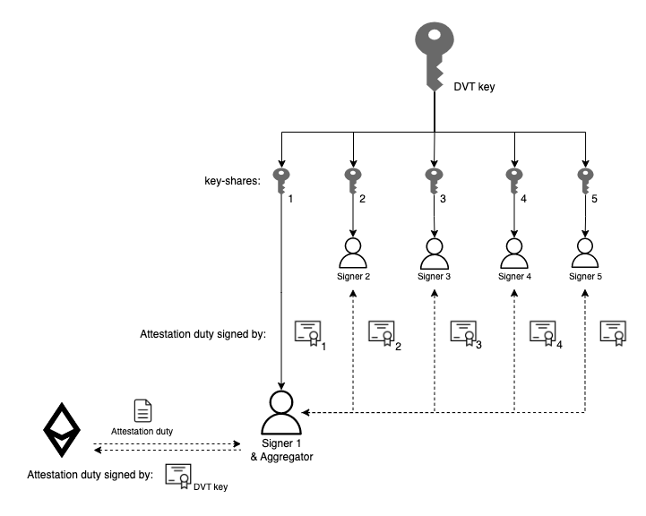

# Distributed validation

## Creation of distributed validators


### Entities
#### Coordinator

#### DKG Participant
### DKG


### Random selection

### Timeframes

### Signature of deposit data to create a validator


## Validation

### Entities
#### Validation set

A validation set is basically a distributed validator. It is a set of `[x from x of y]` signers that manages and perform duties of a distributed validator. It is composed by `[y]` signers. One of those will be an aggregator. As any other validator, a distributed validator must:

- Once per epoch, propose an attestation. This needs the distributed validator signature, therefore n of m signers must sign this duty.
- Eventually, propose blocks. This needs the distributed validator signature, therefore `[x of y]` signers must sign this duty.
- Eventually, be part of a sync-committee, this is something that the Ethereum clients of the aggregator take care of.

#### Signer

They form a validation set by keeping a key-share of the distributed validator and signing its duties. A diva signer is raised for each key-share that is issued to an operator. A signer is part of a single set. The duties of the diva signer are:

- When a new signing duty comes for a new attestation, the signer needs to check the block and that the fee recipient of the block is Diva's. Signers are placed in a node client that is installed along with a consensus and an execution client so the validation of the block can be done with the assistant of the Ethereum clients. For proposing new blocks Diva uses MEV-boost, those blinded blocks that will be signed as long as they validate that the fee-recipient is within the on-chain list of allowed relayers.
- Once the validity of the signing duty has been confirmed, the signer must sign the duty and send it back to the aggregator.

#### Aggregator

One of the signers within a validation set will be an aggregator. Each validator has it own numeric parameter and and each signer can independently calculate its own distance to that number. Each N epochs they are rotating the aggregator role using the distance as order, closest first.

This rotation helps to detect unavailable nodes and to avoid power concentration in a determined signer. After detected unavailability for period of `t`, each signer will start accepting signing-duties from the next closest peer (that peer was a signer that became an aggregator since a new duty will be sent from it).

The aggregator has two main duties within the validation set:

- Sign whatever duty is needed as any other signer from its validation set.
- Aggregate the signatures of the rest of the signers from its validation set.
- Eventually, when the distributed validator related to the validation set is meant to propose a block, the aggregator will build the block or request a block to mev-boost.

```bash
function:
 N above, rotation timing (in epoc)
 constraint: is related to epoch (integer)

function:
 t, unavailability time windows criteria
 constraint: t is time 

```

### Validator actions


#### Watchers

Watchers are used to check on the signers health and behavior. Diva has a set of deterministic watchers in order to validate that signers are available, sign the duties and the messages they send are valid. Watchers periodically sniff encrypted messages. Eventually will send requests to aggregators (source of the messages) asking for the same message but unencrypted. The watcher now knows the un-encrypted message. The watcher also knows the destination therefore the destination's public key and the message that was firstly sniffed which is the message signed by the aggregator with the destination's public key. The watcher validates that the unencrypted message is valid and encrypts the message with the destination's public key and that must match with the sniffed message. This encrypted message must match with the message that the aggregator sent to the signer in first place.


#### Reshare of validator key 
Resharing is a mechanism to re-organize validation set signers without the need for the distributed validator to exit Ethereum. However, there is a limit on the number of resharings allowed by each validator set `[LIMIT]`.
Resharing is specially useful to push out a signer that is not performing well. Or manage the shifting of operator in case there are operators that wish to enter and others that wish to exit signers. 

`bls curve and how many resharing are possible`


#### Exit validator
When Diva detects that enough withdrawals are requested, distributed validator will request a voluntary exit in Ethereum network. An exit message is sent to each signer in a validation set that needs to be signed by `[x of y]` of the signers as any other duty. An incentive for the validation set to start the process is in place. 

`incentive mechanism for voluntary exit`
`do watchers monitor this?`

#### Propose attestation

Each epoch each distributed validator is meant to propose an attestation, the clients of the aggregator handle it for Ethereum. The aggregator then validates the block and creates the attestation message that needs to be signed by the validator set. To get this done, it sends the attestation message to every signer in its validator set and wait for them to send the message signed. Every signer will validate that the attestation is valid, sign it and send it back to the aggregator. When the aggregator receives the first `[x -1 from x of y]` messages signed, it can aggregate each one of those signature with its own and achieve the `[x from x of y]`of the signatures needed for the message to be signed by the validator set. Then, it sends the aggregated signed message which is an attestation to Ethereum. 




#### Propose block

It is known in advance when a validator needs to create a block. The aggregator handles this. It does not build the block itself but outsource it to MEV-boost instead.
MEV-boost is a local client that is integrated in the node and automatically connects to a list of relayers that is available on-chain and maintained by Diva DAO. 

The proposer firstly handles the registration in each relayer, using for that MEV-boost. It sends the registration message with Diva's address as "Recipient Fee" to every signer, aggregates the responses with the signed registration messages and send the signed registration message to the MEV-boost client.
The registration process is needed by relayers to be used as the MEV-boost standard describes. 

Then, when the validator set needs to propose a block, it will request it directly to MEV-boost client that will pass the request to the list of relayers. MEV-boost will receive a blinded-block per each relayer, and will pass the one with higher bid to the aggregator as response to its request. The aggregator, using the same schema as any duty will request to signers to sign the message which happens to be a blinded block. The signers are not able to validate the block but they will validate that the "Recipient fee" is, this time, one of the allowed relayers in the on-chain list. The aggregator will aggregate the signed messages and will send signed blinded block to the MEV-boost that will send it to the previously selected relayer, as response the MEV-boost will receive the block with the transaction, it will pass it to its consensus client and he will propose it to Ethereum. 

