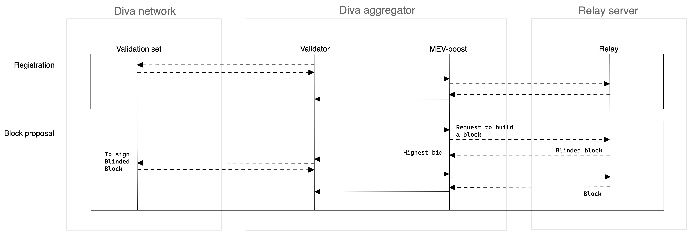

# MEV

#### Propose block using MEV

It is known in advance when a validator needs to create a block. The aggregator handles this. It does not build the block itself, but outsources it to MEV-boost instead.
MEV-boost is a local client that is integrated in the node, and automatically connects to a list of relayers that is available on-chain and maintained by Diva DAO. 

First, the proposer handles the registration in each relayer, using it for the MEV-boost. It sends the registration message with Diva's address as "Recipient Fee" to every signer, aggregates the responses with the signed registration messages, and sends the signed registration message to the MEV-boost client.
The registration process is needed by relayers to be used as the MEV-boost standard describes. 

Then, when the validator set needs to propose a block, it will request it directly to MEV-boost client that will pass the request to the list of relayers. MEV-boost will receive a blinded-block per each relayer, and will pass the one with the higher bid to the aggregator in response to its request. The aggregator, using the same schema as any duty, will request signers to sign the message that happens to be a blinded block. The signers are not able to validate the block, but they will validate that the "Recipient fee" is, this time, one of the allowed relayers in the on-chain list. The aggregator will collect the signed messages and send the signed blinded block to the MEV-boost. This will send it to the previously selected relayer. In response, the MEV-boost will receive the block with the transaction, pass it to its consensus client, and propose it to Ethereum. 

