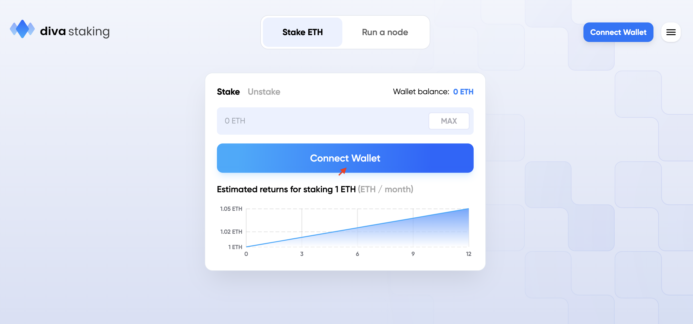
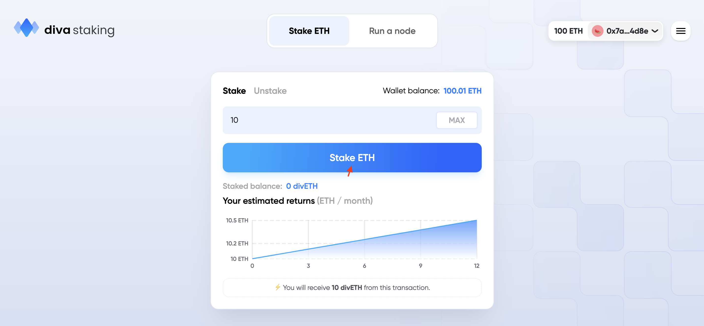
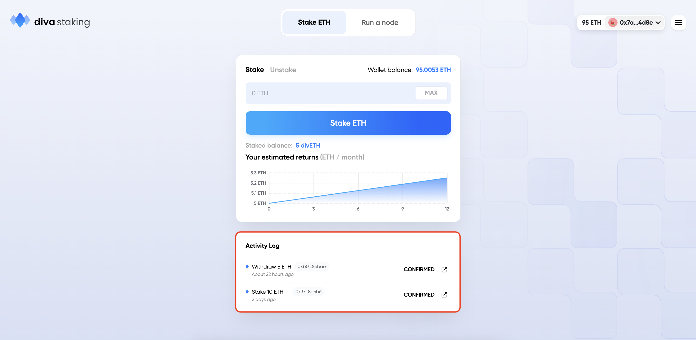
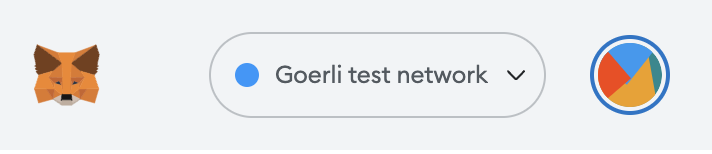
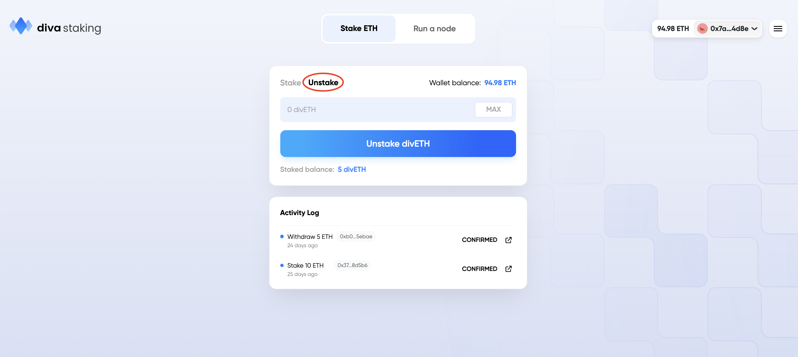
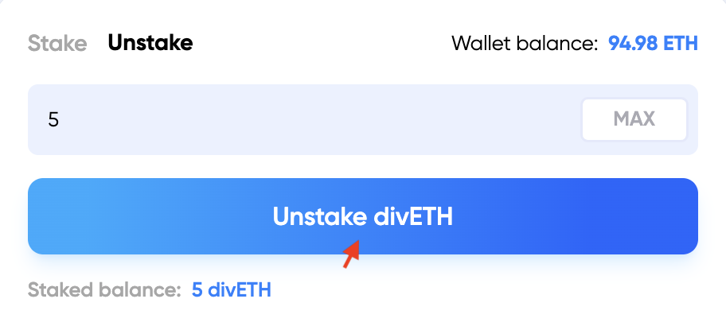

# Testnet Staking Guide

#### Before continuing: 
 - To learn about staking rewards and more please visit
[Staking Economics](econ_rewards)
 - To learn about the divETH token and all its mechanisms, please visit [divETH & wdivETH](lst)
 - To learn about the features of the divETH token, please visit [Features](features)

## How to Stake 

**[🎥 Video instructions for staking on Diva's Goerli Testnet](https://www.loom.com/share/8673f1cbd0f04300b9f2ca4eeb263d88)**

### Directly on the staker web interface

Staking by the web interface:
- Easiest way to stake
- underlying smart contracts work
- The main benefit is that you know for sure that divETH/ETH is always 1:1, no extra fee  whatsoever but the disadvantage is that the transaction cost (gas) might be very expensive regardless the ETH you deposit so for small amounts this may not be the best option.  

## 💠 Step-by-step Guide to Staking

1. Go to **[https://stake.divalabs.org/](https://stake.divalabs.org/)**

    

2. Hit the big blue button to connect your preferred wallet, and you will be prompted to switch to the Goerli test network if you are not already connected. 🟢
    

3. Enter the amount of Goerli you would like to stake on Diva's testnet, and click "Stake ETH".

1.  **Congratulations! You just staked with Diva!** You can view your transaction in the activity log

By holding divETH, you are automatically earning staking rewards.

#### Unstaking

**[🎥 Video instructions for unstaking on Diva's Goerli Testnet](https://www.loom.com/share/5a3c246205834abfa4a4d2d1971dd4ca)**

1. Go to **[https://stake.divalabs.org/](https://stake.divalabs.org/)**

1. Connect your wallet by clicking the big blue "Connect Wallet" button, and switch to Goerli Test Network.

4. Change from "Stake" to "Unstake" at the top of the staking box.

5. Now, all that's left to do is enter the amount you would like to withdraw, and click the big blue "Unstake" button!
    - Confirm the transaction in Metamask.
    - When confirmed the transaction will go through and when completed the divETH balance in your wallet will be updated. 

Note: Trading divETH back for ETH is only possible when the staking liquidity pool has enough ETH in it to handle your trade. Otherwise an exit needs to be performed. So the withdrawal is guaranteed but not immediately. 

To learn more about rewards, go to [Staking Economics](docs/staker_faq) ⇒ Ethereum Rewards.

The source of the ETH is from both Stakers and Operators. 